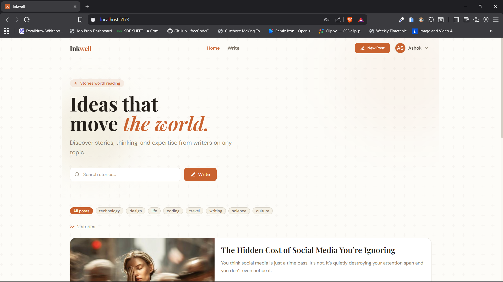
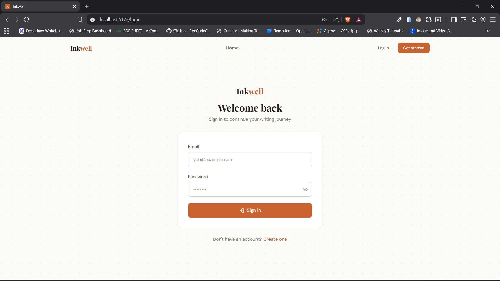
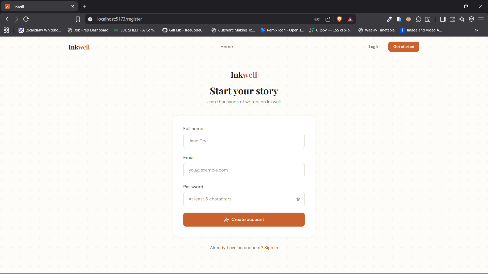
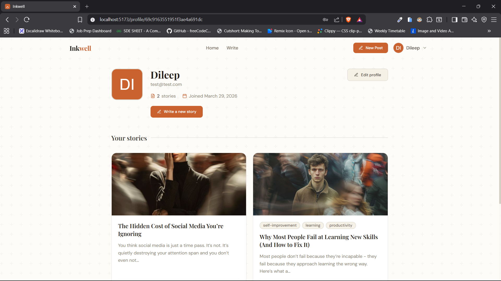
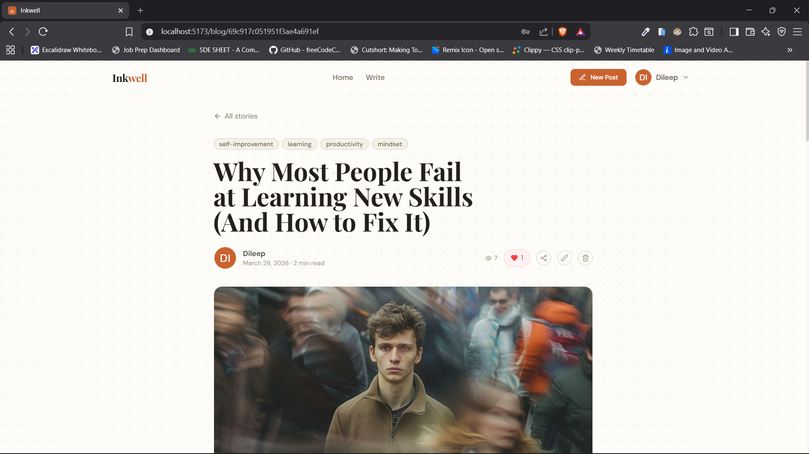
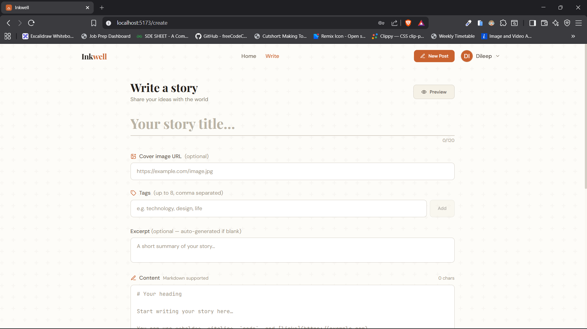

# 🖊️ Inkwell - MERN Stack Blog CMS

A production-ready, full-stack blog platform built with MongoDB, Express, React, and Node.js.

---

## 🌐 Live Demo

 **Live App:** https://live-link.com

---

## ✨ Features

| Category | Features |
|---|---|
| **Auth** | Register · Login · Logout · JWT HTTP-only cookies · Protected routes |
| **Blogs** | Create · Read · Update · Delete · Markdown editor · Live preview |
| **Social** | Like/Unlike · Comment · Delete comment · View count |
| **Search** | Full-text search · Tag filtering · Pagination |
| **Profiles** | View profile · Edit profile · User blog feed |
| **UX** | Skeleton loading · Toast notifications · Smooth scroll (Lenis) · GSAP animations |

---

## 🖼️ Screenshots

### 🏠 Home Page


### 🔐 Login Page


### 📝 Register Page


### 👤 User Profile


### 📖 Blog Detail Page


### ✍️ Create Story


---

## 🗂️ Project Structure

```
mern-blog/
├── package.json              ← root scripts (concurrently)
│
├── server/                   ← Express API
│   ├── controllers/
│   │   ├── authController.js
│   │   ├── blogController.js
│   │   └── userController.js
│   ├── middleware/
│   │   ├── authMiddleware.js      ← JWT protect / optionalAuth
│   │   ├── errorMiddleware.js     ← global error handler
│   │   └── validationMiddleware.js ← express-validator rules
│   ├── models/
│   │   ├── User.js               ← bcrypt hashing, password select:false
│   │   └── Blog.js               ← comments sub-doc, likes array, virtuals
│   ├── routes/
│   │   ├── authRoutes.js
│   │   ├── blogRoutes.js
│   │   └── userRoutes.js
│   ├── utils/
│   │   ├── ApiError.js           ← custom error class + asyncHandler
│   │   └── generateToken.js      ← JWT sign + HTTP-only cookie setter
│   ├── .env.example
│   ├── package.json
│   └── server.js
│
└── client/                   ← React + Vite frontend
    ├── src/
    │   ├── components/
    │   │   ├── layout/
    │   │   │   ├── Navbar.jsx
    │   │   │   ├── Footer.jsx
    │   │   │   └── ProtectedRoute.jsx
    │   │   └── ui/
    │   │       ├── BlogCard.jsx
    │   │       ├── CommentSection.jsx
    │   │       ├── Pagination.jsx
    │   │       └── Skeletons.jsx
    │   ├── hooks/
    │   │   └── useScrollAnimation.js  ← Lenis + GSAP hooks
    │   ├── pages/
    │   │   ├── Home.jsx
    │   │   ├── Login.jsx
    │   │   ├── Register.jsx
    │   │   ├── CreateBlog.jsx
    │   │   ├── EditBlog.jsx
    │   │   ├── BlogDetail.jsx
    │   │   ├── Profile.jsx
    │   │   └── NotFound.jsx
    │   ├── redux/
    │   │   ├── store.js
    │   │   └── slices/
    │   │       ├── authSlice.js   ← register, login, logout, fetchMe, updateProfile
    │   │       └── blogSlice.js   ← CRUD + likes + comments
    │   ├── services/
    │   │   └── api.js             ← Axios instance + all API methods
    │   └── utils/
    │       └── helpers.js         ← date, reading time, avatar, truncate
    ├── index.html
    ├── tailwind.config.js
    ├── vite.config.js
    └── package.json
```

---

## ⚡ Quick Start

### Prerequisites
- Node.js v18+
- MongoDB running locally OR a MongoDB Atlas URI

### 1. Clone & install

```bash
git clone <repo-url> mern-blog
cd mern-blog
npm run install:all
```

### 2. Configure environment

```bash
cd server
cp .env.example .env
```

Edit `server/.env`:

```env
PORT=5000
MONGO_URI=mongodb://localhost:27017/mern-blog
JWT_SECRET=change_this_to_a_long_random_string
JWT_EXPIRES_IN=7d
NODE_ENV=development
CLIENT_URL=http://localhost:5173
```

### 3. Run both servers

```bash
# From the root directory:
npm run dev
```

This starts:
- **API** → `http://localhost:5000`
- **UI**  → `http://localhost:5173`

### 4. Open the app

Visit [http://localhost:5173](http://localhost:5173)

---

## 🔌 API Reference

### Auth — `/api/auth`

| Method | Endpoint | Auth | Body | Description |
|--------|----------|------|------|-------------|
| POST | `/register` | — | `{name, email, password}` | Create account |
| POST | `/login` | — | `{email, password}` | Sign in, sets cookie |
| POST | `/logout` | — | — | Clear cookie |
| GET | `/me` | ✅ | — | Get current user |
| PUT | `/update-profile` | ✅ | `{name, bio, avatar}` | Update profile |

### Blogs — `/api/blogs`

| Method | Endpoint | Auth | Query/Body | Description |
|--------|----------|------|------------|-------------|
| GET | `/` | — | `?page&limit&tag&search` | Get all blogs (paginated) |
| GET | `/:id` | — | — | Get single blog (increments views) |
| POST | `/` | ✅ | `{title, content, coverImage?, tags?, excerpt?}` | Create blog |
| PUT | `/:id` | ✅ | Same as create | Update (owner only) |
| DELETE | `/:id` | ✅ | — | Delete (owner only) |
| POST | `/:id/like` | ✅ | — | Toggle like |
| POST | `/:id/comments` | ✅ | `{text}` | Add comment |
| DELETE | `/:blogId/comments/:commentId` | ✅ | — | Delete comment |

### Users — `/api/users`

| Method | Endpoint | Auth | Description |
|--------|----------|------|-------------|
| GET | `/:id` | — | Get user profile |
| GET | `/:id/blogs` | — | Get user's published blogs |

---

## 📦 Sample API Responses

**GET /api/blogs**
```json
{
  "success": true,
  "blogs": [
    {
      "_id": "65f...",
      "title": "Getting Started with GSAP",
      "excerpt": "GSAP is the gold standard for web animation...",
      "coverImage": "https://...",
      "tags": ["animation", "javascript"],
      "author": { "_id": "65e...", "name": "Jane Doe", "avatar": "" },
      "likeCount": 12,
      "commentCount": 3,
      "views": 241,
      "createdAt": "2024-03-15T10:00:00.000Z"
    }
  ],
  "pagination": {
    "page": 1, "limit": 9, "total": 47,
    "pages": 6, "hasNext": true, "hasPrev": false
  }
}
```

**POST /api/auth/login — Error**
```json
{
  "success": false,
  "message": "Invalid email or password"
}
```

---

## 🏗️ Key Architectural Decisions

### Backend

| Decision | Rationale |
|----------|-----------|
| **HTTP-only cookies for JWT** | Prevents XSS attacks — JS on the page cannot read the token |
| **`asyncHandler` wrapper** | Eliminates try/catch boilerplate in every controller |
| **`ApiError` class** | Unified error format; the global middleware handles all cases |
| **`select: false` on password** | Password never leaks into responses accidentally |
| **Embedded comments** | Comments are sub-documents on Blog — no separate collection join needed |
| **`optionalAuth` middleware** | Public routes know *who* is requesting without blocking unauthenticated users |

### Frontend

| Decision | Rationale |
|----------|-----------|
| **Redux Toolkit slices** | Co-locates state, actions, and reducers; async thunks handle all API side effects |
| **Axios interceptors** | Single place for error normalization and auto-logout on 401 |
| **Vite proxy** | Dev requests to `/api` are proxied to Express, so cookies work cross-port |
| **Lenis + GSAP** | Lenis drives smooth scroll; GSAP's ScrollTrigger is synced to Lenis's scroll position |
| **`initialized` flag in auth state** | Prevents the "flash of login page" on hard refresh while cookie is being verified |
| **`data-reveal` attribute** | GSAP `useScrollReveal` hook scopes to a container ref and animates all `[data-reveal]` children |

---

## 🔐 Security Checklist

- [x] Passwords hashed with bcrypt (saltRounds: 12)
- [x] JWT stored in HTTP-only, SameSite=Strict cookie
- [x] Input validation via `express-validator` on all mutation routes
- [x] Authorization checked in controllers before any mutation
- [x] CORS locked to `CLIENT_URL` in env
- [x] Mongoose `select: false` on password field
- [x] Error messages never leak stack traces in production

---

## 🧪 Testing the API manually

```bash
# Register
curl -c cookies.txt -X POST http://localhost:5000/api/auth/register \
  -H "Content-Type: application/json" \
  -d '{"name":"Test User","email":"test@example.com","password":"password1"}'

# Create a blog (uses saved cookie)
curl -b cookies.txt -X POST http://localhost:5000/api/blogs \
  -H "Content-Type: application/json" \
  -d '{"title":"Hello World","content":"My first post!"}'
```

---

## 🎯 What Makes This Project Stand Out

- Full authentication system with **secure cookies (not localStorage hacks)**
- Real-world blog system with **likes, comments, views**
- Clean UI that actually looks like a product (not a college project)
- Scalable architecture (controllers, middleware, slices)
- Production-level decisions (error handling, validation, protected routes)

---

## 👨‍💻 Developer

**Dileep Kumawat**

- 💻 Full Stack Developer (MERN)
- ⚡ Focused on building real-world scalable apps
- 🧠 Strong in system design + clean architecture

---

## 📬 Contact

- 📧 Email: dileepkumawat525@gmail.com 
- 💼 LinkedIn: https://linkedin.com/in/dileep-kumawat 
- 🐙 GitHub: https://github.com/Dileep-kumawat 
- 🔗 Twitter(X) : https://x.com/dilsecode
- 😎 Instagram : https://www.instagram.com/dileep.52/